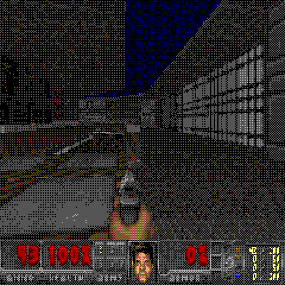
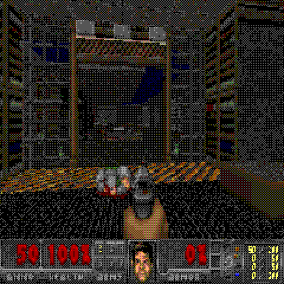
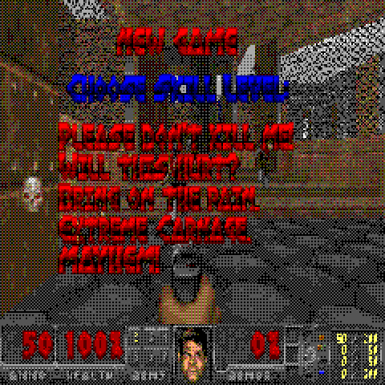
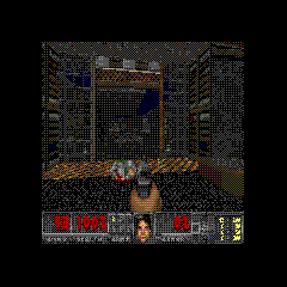

# UOOM — DOOM on the UNA Watch

A port of [doomgeneric](https://github.com/ozkl/doomgeneric) to the
[UNA Watch](https://www.developers.unawatch.com/): a 240×240 memory-in-pixel
panel with 8 bits per pixel, four buttons, an STM32U595, and no audio path.

<p align="center">
  
  
  
  
</p>

*Real output from this port's pipeline — DOOM's 320×200 indexed frames
resampled and dithered down to the panel's 2-bits-per-channel ABGR2222 —
captured from the host harness. The first three fill the 240×240 square; the
fourth is `UOOM_SCALE_MODE=2`, which fits the whole frame inside the panel's
visible circle so nothing is clipped. Freedoom art.*

## Status

**It runs on the watch.** DOOM boots from a WAD on the watch's own storage,
renders to the 240x240 memory-in-pixel panel at the kernel's 10 Hz tick, and
takes input from all four buttons.

| | |
|---|---|
| DOOM boots, loads a level, renders, responds to input | **verified**, end to end, on the host harness |
| Palette collapse to 64 colours + ordered dither | **verified**, with screenshots |
| 320×200 → 240×240 resample, both fill and letterbox modes | **verified** |
| Four-button control scheme (taps, holds, chords, menu context) | **verified** by unit tests |
| WAD access with no stdio, savegame I/O with no `FILE*` | **verified** on the host |
| Engine patches (18 files, ~150 lines) | **verified** — applied, compiled, run |
| A latent heap-corruption bug in `R_CheckPlane` | **found and fixed** — see below |
| RAM diet stages 1–2 | **done**, and proven inert by frame-hash equality |
| Zone fits shareware `DOOM1.WAD` in ~1 MB, from the kernel heap | **measured** |
| **Builds for the watch** | **yes** — links for Cortex-M33 and packs a `304 KB` installable `.uapp` |
| **Platform layer runs on the watch** | **yes** — 10.0 Hz tick measured, press/release codes confirmed, own GUI task accepted |
| **Runs on the watch** | **yes** — playable, all four buttons confirmed on hardware |
| Reports itself without a debug adapter | on-screen boot report + `uoom.log` over USB |

```
$ tools/build-watch.sh
[100%] Merging UOOM application
INFO:root:Image : Output/UOOM_0.0.1.uapp (309284 bytes)
```

## What it took

Five faults stood between "links cleanly" and "runs", and every one of them
produced the same symptom — a blank screen — with no console, no debugger and
one bit of information per flashing cycle:

| | |
|---|---|
| `IFile::write` without `IFile::flush()` | the log died with the app, so the first run left an empty file |
| The panel drops frames until `COMMAND_APP_GUI_RESUME` is dequeued | the error screen was drawn before the first tick, so failures were invisible |
| `FixedDiv`'s 64-bit divide had no `__aeabi_ldivmod` | the SDK's linker script discards `libgcc.a` |
| The zone fits in neither the kernel's heap nor a single app image | it lives in the **service process**; the GUI is handed the address at run time |
| The custom-message queue was never drained | `waitForFrameTick()` only *queues* app messages. In a TouchGFX app the generated `handleTickEvent()` drains them; **nothing in the SDK itself does** |

What made them separable was giving the service its own log file and tracing
the wait loop tick by tick. Before that, each one looked exactly like the last.
`docs/08-first-boot-debugging.md` has the full account, including the ballast
probes that measured the loader's ceiling — a number no document in the SDK
predicts.

## It fits

Real ARM figures, from the linked binary. **Every byte of this is RAM** — the
SDK's app linker script has one memory region and no flash, so `.text` and
`.rodata` count exactly like `.bss`:

| | |
|---|---|
| `.text` | 229 920 |
| `.data` + `.got` | 62 912 |
| `.bss` | 279 244 |
| `.stack` | 24 576 |
| **GUI process total** | **596 775** — inside its 900 KB ceiling, with 325 KB spare |
| Service process total | 6 716 |
| DOOM's zone | ~1 MB, from the **kernel's** heap, outside the app region |

That is ~1.6 MB all in, against the ~2.5 MB this page used to predict. The
three things that closed the gap are in the section below.

The four biggest objects in the binary, for anyone continuing the diet:
`sScreen` 64 000 (DOOM's 320x200 8bpp screen), `visplanes` 63 744,
`sPanel` 57 600 (the 240x240 framebuffer), `finesine` 40 960.

## Memory: the number that decides this port

DOOM's zone heap needs, measured across all three attract-mode demos
(E1M1/E1M5/E1M7 — the standard shareware stress set):

| IWAD | zone floor | peak used |
|---|---|---|
| shareware `DOOM1.WAD` | **1024 KB** | 571 KB |
| Freedoom Phase 1 | 2048 KB | 1680 KB |

Freedoom's maps are about four times the geometry of the shareware ones, and
designing against it was the wrong worst case.

Three findings shrank this from "does not fit" to "probably fits":

1. **The zone does not live in the app's RAM region.** The SDK's linker script
   has one memory region and no flash — code and rodata compete with `.bss` —
   but `malloc` forwards to the *kernel's* allocator, whose heap is outside that
   region entirely. `RAM_LENGTH` is a link-time ceiling with no cap and no
   runtime cost.
2. **The host overstates the requirement by about a third.** DOOM's level
   structures are pointer-dense; `tools/struct-sizes.sh` measures `line_t` at
   44 bytes on ARM against 72 here.
3. **The remaining gap is a to-do list, not a wall.** The same 240×240 DOOM has
   been fitted into **256 KB** twice on this exact core class, with published
   numbers (`docs/reference/prior-art.md`). Two stages of that diet are done
   and verified here.

And then hardware added a constraint no document predicts: **the loader hands
out between 878 KB and 1 009 KB per app image**, measured by weighing down the
13 KB smoke build until it stopped running. The GUI needs 599 KB of that for
DOOM itself, so the arena does not fit beside it — and the kernel's heap could
not supply 640 KB either. It lives in the **service process** instead, which is
a separate image with its own ceiling, and the GUI is handed the address at run
time. There is no MMU; the SDK says so outright. See
[`docs/08-first-boot-debugging.md`](docs/08-first-boot-debugging.md).

What is still unknown is the size of the kernel's heap — one message
(`RequestMemoryInfo`) answers it on device. `docs/03-memory-budget.md` has the
sweeps, the per-array breakdown and the remaining stages.
`docs/03-memory-budget.md` has our measurements, the sweep that found the
floor, a trace of which allocations dominate, and eight ranked ways out —
starting with "measure it with shareware `DOOM1.WAD` instead of Freedoom, whose
maps are much larger".

## Try it in thirty seconds, no watch required

```sh
tools/fetch-doomgeneric.sh          # vendor DOOM at a pinned commit + apply patches
tests/run.sh                        # unit-test the port layers, 4 configurations
```

Then:

```sh
make -C host
./host/out/uoom-host --wad wad --frames 600 --dump host/out/frames --every 120 \
  --keys "30:e,32:d,60:e,62:d,90:e,92:d,120:e,122:d,300:q,420:r"
tools/ppm2png.py host/out/frames/*.ppm --scale 2
```

That runs the real engine through the real port layers and writes PNGs of
exactly what the watch's panel would show. `--keys FRAME:CODE` injects the
kernel's own button codes, so a scripted run is reproducible frame for frame.

For the watch build, see `docs/06-build-and-deploy.md`.

## How it works

DOOM lives in the **GUI process**, not the service — that is where the
framebuffer, the frame tick and the buttons are. It does not use TouchGFX at
all: it takes over the GUI task, runs its own loop, and hands the kernel a
finished 240×240 ABGR2222 buffer each frame.

```
   third_party/doomgeneric        unmodified upstream, patched by script
             |  DG_Init / DG_DrawFrame / DG_GetKey / DG_GetTicksMs
             v
   doomgeneric_uoom.c             frame loop; actions -> DOOM keycodes
             |
   +---------+-----------+---------------+--------------+
 uoom_video  uoom_input  uoom_file     uoom_sys      uoom_text
 (palette,   (4-button   (WAD, saves)  (zone, panic) (error screens,
  resample)   state m/c)                              diagnostics)
   |            |            |              |             |
   +------------+------ uoom_plat.h --------+-------------+
                             |
              +--------------+---------------+
        uoom_una_platform.cpp          host/host_platform.c
        (the watch)                    (a laptop, PPM output)
```

Everything above `uoom_plat.h` is plain C with no knowledge of the SDK or of an
operating system. That is not tidiness for its own sake: it is why the palette
collapse, the resample, the control scheme and the WAD layer can be tested in
under a second on a laptop, and why the two files that can only be checked on
hardware contain no decisions.

The single most valuable thing the port does is *not* convert frames. Every
stock doomgeneric backend expands DOOM's 8-bit output into a 32-bit buffer
(230–256 KB) because SDL and X11 want true colour. This panel is itself 8 bits
per pixel, so the palette is applied during the resample and that buffer never
exists. On this budget, that one decision is the difference between shipping
and not.

## Controls

Four buttons, eleven actions. Resolved by timing rather than by more buttons.

| Input | In game | In menu |
|---|---|---|
| **L1** (top-left) hold | turn left | up (repeats) |
| **L2** (bottom-left) hold | turn right | down (repeats) |
| **R1** (top-right) hold | walk forward | confirm |
| **R1** tap | use / open door | |
| **R2** (bottom-right) | fire | back |
| **R2** double-tap | next weapon | |
| **L1 + L2** tap | menu | |
| **L1 + L2** hold | walk backward | |

One more constraint the SDK docs do not mention: the panel's active area is a
**circle** of radius 120 inside the 240x240 grid, so the corners are not
visible and the ends of DOOM's 320-pixel status bar fall off the glass.
`UOOM_SCALE_MODE=2` renders into the largest square that fits the circle;
`docs/07-open-questions.md` has the better long-term answer.

`L1+L2` is the only safe chord on this device — every left-plus-right pair is a
normal combat or movement combination. `docs/05-input.md` works through why,
and why forward starts on the press rather than waiting to see if it was a tap.

## Layout

```
Software/Apps/UOOM-CMake/     the .uapp build (SDK layout)
Software/Libs/Header|Sources/ the port: 5 platform-free C layers + 3 UNA files
third_party/doomgeneric/      vendored upstream, not committed
tools/                        vendoring, engine patches, icons, font, PPM->PNG
host/                         run the whole thing on a laptop
tests/                        port-layer tests, 4 build configurations
docs/                         see below
```

## Docs

| | |
|---|---|
| [`01-platform.md`](docs/01-platform.md) | what this machine is, cited, including where the SDK docs contradict themselves |
| [`02-architecture.md`](docs/02-architecture.md) | two processes, five seams, the frame loop, lifecycle |
| [`03-memory-budget.md`](docs/03-memory-budget.md) | **the measurements**, and the ways out |
| [`04-video.md`](docs/04-video.md) | 64 colours, dithering, resample, why not bilinear |
| [`05-input.md`](docs/05-input.md) | four buttons, and the click-only fallback |
| [`06-build-and-deploy.md`](docs/06-build-and-deploy.md) | toolchain, build, getting a WAD onto the watch |
| [`07-open-questions.md`](docs/07-open-questions.md) | the unknowns, each with an experiment |
| [`08-first-boot-debugging.md`](docs/08-first-boot-debugging.md) | **when the watch shows nothing** — the bisection build and how to read the trace |
| [`reference/una-sdk-verified.md`](docs/reference/una-sdk-verified.md) | the SDK API read from source — and where the public docs were wrong |
| [`reference/`](docs/reference/) | doomgeneric internals, prior art on sub-256 KB DOOM ports, the docs-only SDK reading |

## Engine changes

Thirteen files, about a hundred lines, applied by
`tools/apply-uoom-patches.py` rather than kept as diffs — every substitution
asserts its own match count, so an upstream bump fails loudly instead of a
patch hunk rotting silently. `tools/show-uoom-diff.sh` prints the result.

| | |
|---|---|
| video hook | 8bpp straight to the panel; no `DG_ScreenBuffer` |
| zone | static arena instead of `malloc(6 MB)`; `I_Error` to the screen |
| renderer limits | six constants, 110 KB of static |
| input drain | upstream drops every key-up after the first in a tic — a stuck key on a four-button device |
| no wipes | ~192 KB of zone peak |
| no stdio | `M_MakeDirectory`, `M_FileExists`, savegames, screenshots |
| latent-bug guards | `R_CheckPlane`'s missing bounds check, `MAXSEGS` raised to the real bound, `I_VideoBuffer` out of the zone |
| RAM diet | `line_t` 68 → 44 bytes, `node_t` 52 → 36, on 32-bit ARM |
| `FixedDiv` without libgcc | the SDK's linker script discards `libgcc.a`, so `((int64_t)a << 16) / b` — **per column of the frame** — has no `__aeabi_ldivmod` to call. Replaced with two hardware 32-bit divides; bit-identical output |

The `R_CheckPlane` one is worth singling out. `R_FindPlane` bounds-checks before
bumping `lastvisplane`; `R_CheckPlane` does not, in vanilla or in doomgeneric.
Lowering `MAXVISPLANES` turns that from theoretical into reachable — and the
first measurement of this port reported that 64 visplanes "survived 500 frames"
when it was in fact writing 664 bytes past the array on every overflow. With
the guard added, 64 fails immediately and the real floor is 96.

## Legal

- doomgeneric and the DOOM source are **GPLv2**. This port is a derivative
  work; anything published from it inherits that.
- **No IWAD is committed here**, and `tools/fetch-wad.sh` downloads one rather
  than this repository carrying it. The distinction that matters is between the
  two kinds:
  - **Shareware `DOOM1.WAD`** — id distributed the shareware release for free
    copying, which is why it is on public archives and packaged by Linux
    distributions to this day. That licence covers the *complete, unmodified*
    shareware package; a bare extracted WAD is not literally that, which is why
    the script fetches it and nothing here re-hosts it.
  - **Registered `DOOM.WAD` / `DOOM2.WAD`** — id Software's property, not
    redistributable. Use your own copy, from Steam, GOG or a 1990s CD.
  - **[Freedoom](https://freedoom.github.io/)** — a BSD-licensed IWAD that plays
    with this engine, with no question to answer. It is the default of
    `fetch-wad.sh` and what the screenshots above show.

  See [`docs/06-build-and-deploy.md`](docs/06-build-and-deploy.md) for where
  each one goes and what it costs in RAM.
